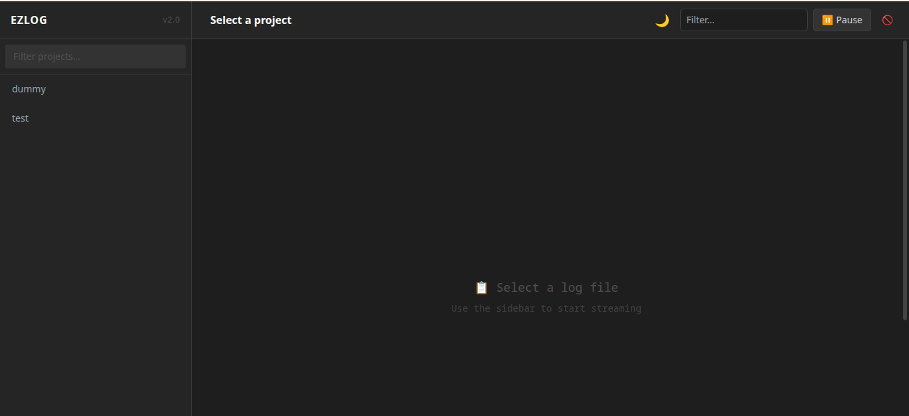
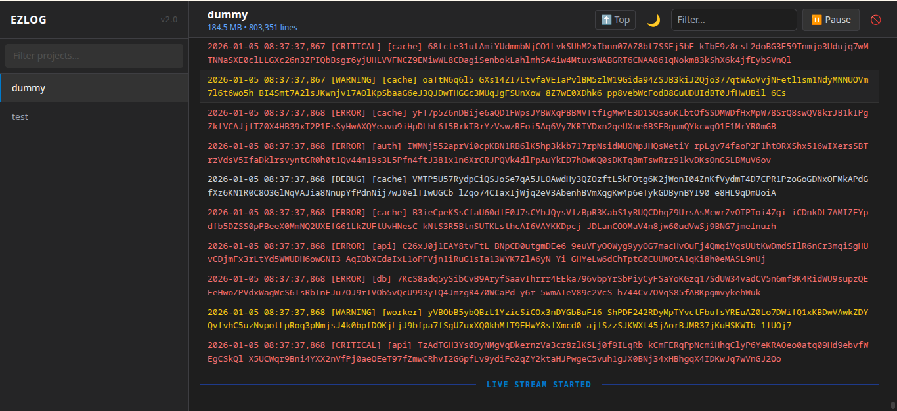
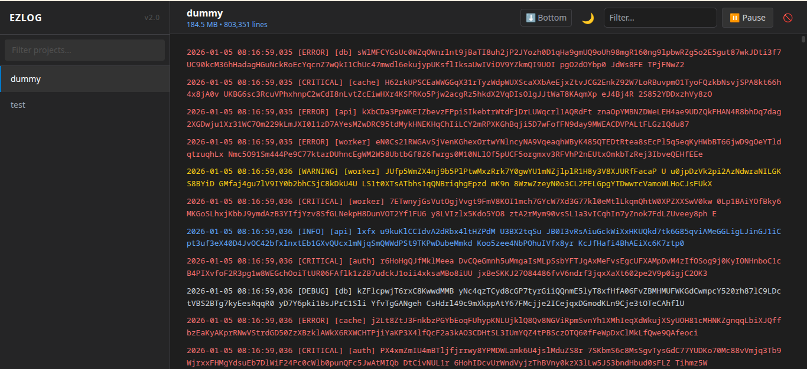

# EZLog - Simple Log Viewer for Linux Servers

A standalone, web-based log viewer with real-time streaming.

## Features

- 📊 Real-time log streaming via WebSockets
- 📁 Track multiple logs with simple aliases
- 🌐 Web interface for easy viewing
- 🚀 Standalone binary - no Python installation needed
- ⚡ Fast loading - shows last 500 lines instantly
- 🔄 Infinite scroll - loads history as you scroll up
- 🎯 Navigation buttons - jump to top/bottom quickly
- ⏸️ Pause/Resume - buffer logs while you read
- 🔍 Real-time filtering
- 🎨 Multiple themes (Dark, Light, Solarized)
- 📱 Mobile responsive
- 🔧 Simple CLI for log management

---

## 🚀 Quick Start (For Users)

### Step 1: Download the latest version

Visit the releases page: [https://github.com/legeRise/ezlog/releases](https://github.com/legeRise/ezlog/releases/latest/download/ezlog-linux-x64.tar.gz)

Or use command line:
```bash
cd ~/Downloads
wget https://github.com/legeRise/ezlog/releases/latest/download/ezlog-linux-x64.tar.gz
```

### Step 2: Extract the archive

```bash
tar -xzf ezlog-linux-x64.tar.gz
cd ezlog-linux-x64
```

### Step 3: Install system-wide

```bash
sudo ./install.sh
```

This will install ezlog to `/usr/local/ezlog/` and make it available system-wide.

### Step 4: Verify installation

Open a new terminal and run:
```bash
ezlog --help
```

If you see the help message, installation was successful.

### Step 5: Clean up

Now that ezlog is installed system-wide, you can delete the download folder:
```bash
cd ~/Downloads
rm -rf ezlog-linux-x64
rm ezlog-linux-x64.tar.gz
```

### Step 6: Use ezlog

```bash
ezlog add myapp /var/log/myapp.log
ezlog list
ezlog start
# Open browser: http://localhost:9200
```


*Screenshot: Main view showing log list in sidebar*

---

## 🛠️ Build from Source (For Developers)

1. Clone the repository:
   ```bash
   git clone https://github.com/legerise/ezlog.git
   cd ezlog
   ```

2. Build the binary:
   ```bash
   chmod +x build.sh
   ./build.sh
   ```
   This creates `dist/ezlog/` with the standalone binary.

3. Install system-wide:
   ```bash
   sudo ./install.sh
   ```
   This installs the binary to `/usr/local/ezlog/` and creates a symlink at `/usr/local/bin/ezlog`.

---

## 📖 Usage

### Example Scenario: Managing Multiple Project Logs

Let's say you're a developer working on a server with 5 different projects, each with their own log files in different locations:

```
/var/log/nginx/access.log
/home/user/myapp/logs/app.log
/opt/api-server/logs/api.log
/var/www/website/errors.log
/home/user/scripts/cron.log
```

Instead of remembering these long paths and using `tail -f` for each one, ezlog lets you organize them.

### Step 1: Add logs with aliases

An **alias** is a short nickname you give to a log file. Instead of typing the full path, you use the alias.

```bash
# Syntax: ezlog add <alias> <full-path-to-log-file>

```bash
ezlog add nginx /var/log/nginx/access.log
ezlog add myapp /home/user/myapp/logs/app.log
ezlog add api /opt/api-server/logs/api.log
ezlog add website /var/www/website/errors.log
ezlog add cron /home/user/scripts/cron.log
```

After each command, you'll see:
```
Added nginx -> /var/log/nginx/access.log
```

### Step 2: Verify logs are tracked

Check all tracked logs:
```bash
ezlog list
```

Output:
```
nginx           /var/log/nginx/access.log
myapp           /home/user/myapp/logs/app.log
api             /opt/api-server/logs/api.log
website         /var/www/website/errors.log
cron            /home/user/scripts/cron.log
```

Now you can see all your logs and their aliases at a glance.

### Step 3: Start ezlog

```bash
ezlog start
```

Output:
```
✅ Started ezlog in background (PID: 12345)
🌐 Visit http://0.0.0.0:9200
⏹️  Stop with: ezlog stop
```

### Step 4: View logs in your browser

Open your browser and go to: `http://localhost:9200`

You'll see a web interface with all your tracked logs listed. Click any alias (nginx, myapp, api, etc.) to view that log in real-time.


*Screenshot: Log file selected and displaying live logs*


*Screenshot: Scrolled to top of log file showing oldest entries*

### Managing Your Logs

**Update a log path:**
```bash
# If your log file moves to a new location
ezlog update myapp /home/user/newpath/app.log
```

**Remove a log:**
```bash
# Stop tracking a log file
ezlog remove cron
```

**Custom port and host:**
```bash
# Run on a different port
ezlog start --port 8000

# Run on localhost only (more secure)
ezlog start --port 9200 --host 127.0.0.1
```

**Process management:**
```bash
ezlog status          # Check if running
ezlog stop            # Stop background process
ezlog start           # Start in background
ezlog run             # Run in foreground (for debugging)
```

### Where is tracking data stored?

All your tracked logs are saved in: `~/.ezlog/tracked_logs.json`

This means each user on the system can track their own logs independently.

## Requirements

- **Build time**: Python 3.9+, pip, PyInstaller
- **Runtime**: None! The binary is completely standalone

## How it works

1. Track log files with aliases
2. Start the web server (runs in background)
3. View logs in real-time through your browser
4. WebSocket streams new log lines as they're written
5. Scroll up to load history in 500-line chunks
6. Use navigation buttons to jump to top/bottom
7. Pause to read, resume to continue streaming

## Uninstall

```bash
sudo rm -rf /usr/local/ezlog
sudo rm /usr/local/bin/ezlog
rm -rf ~/.ezlog  # Optional: removes tracked log config
```

## Development

Run in development mode:

```bash
pip install -r requirements.txt
python cli.py run --port 9200
```

## License

MIT
